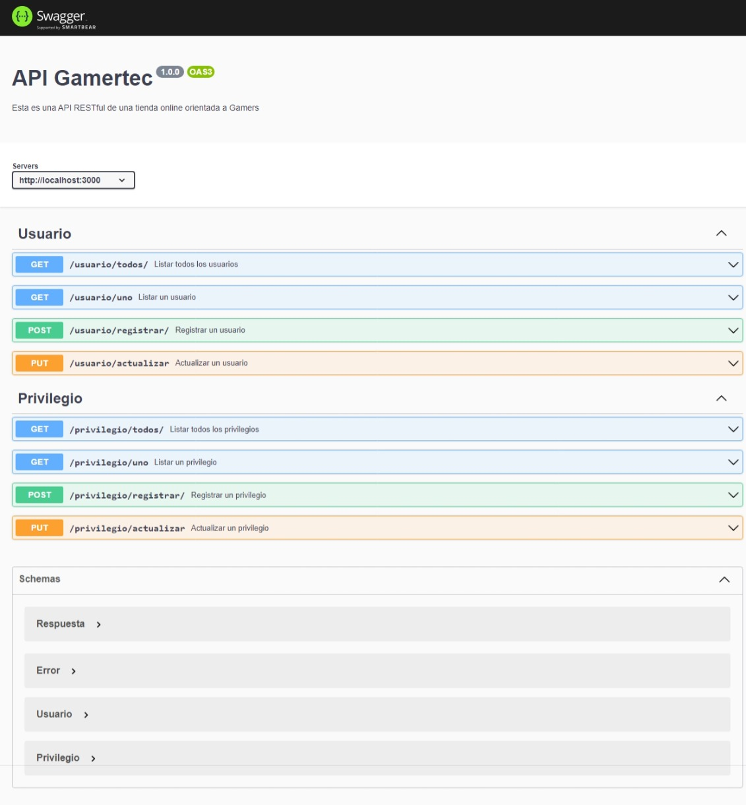

# Gamertec Api

api de tienda online Gamertec, desplegada en Railway

## Previsualización

previsualizacion de `despliegue utilizando Swagger`



## Instalar Dependencias

```bash
  npm install
```

## Configurar Variables de Entorno

### 1. Crear arhivo .env

crear arhivo .env en la raiz del proyecto, con las siguientes variables:

```js
//VARIABLE = "VALOR" // EJEMPLO
DB_SERVER = ""; // SERVERDB
DB_USER = ""; // USERDB
DB_PASSWORD = ""; // PASSWORDDB
DB_NAME = ""; // NAMEDB
DB_PORT = 0; // 1433
API_HOST = ""; // http://localhost:3000
API_PORT = 0; // 3000
```

### 2. Configurar variables de entorno

estas variables se tienen que configurar para que pueda cargar el proyecto, tener en cuenta que el proyecto se configuró con `SQL SERVER`
| variable | descripcion |
| :- | :- |
| `DB_SERVER` | `Nombre del servidor de BD` |
| `DB_USER` | `Usuario de login de BD` |
| `DB_PASSWORD`| `Contraseña de login de BD` |
| `DB_NAME` | `Base de Datos a la que se quiere conectar` |
| `DB_PORT` | `Puerto con el que trabaja SQL` |
| `API_HOST` | `URL del despligue de la API (dominio principal)`|
| `API_PORT` | `Puerto para la API` |

## Iniciar Proyecto

despues de configurar las variables ya podemos correr la API en modo desarrollo

```bash
  npm run dev
```
